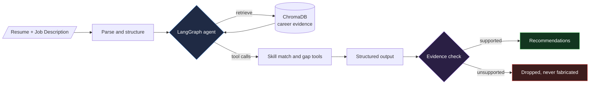
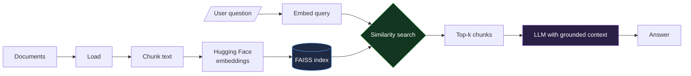
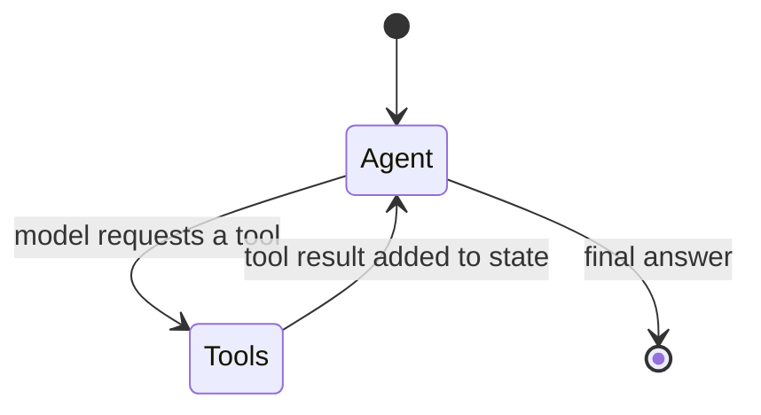

 

<table>
<tr>
<td></td>
<td></td>
</tr>
<tr>
<td></td>
<td></td>
</tr>
</table>

<b>CareerPilot: evidence-first recommendation flow</b>

<b>RAG pipeline: from documents to grounded answers</b>

<b>Tool-calling agent: graph state machine</b>

| | Role | What I did |
|---|---|---|
| **2026** | **AI/ML Intern** TANSAM, Chennai | Built an e-commerce **customer segmentation** system with **RFM analysis** and clustering; handled preprocessing, feature engineering and EDA to surface customer behavior insights. |
| **2026, upcoming** | **Selected Intern, AI/ML** Infosys Virtual Internship 7.0 | Selected to build an **AI-driven multi-agent negotiation training and simulation platform** using LLM-based agents and multi-agent workflows. |
| **2026** | **Open Source Contributor** OSCI and PrepPilot | Investigated issues, fixed bugs, wrote tests and opened PRs with code review. Fixed text-processing and CLI validation issues in *clippings-vids*; contributed backend parsing, AI prompt validation, tests and CI work in *PrepPilot*. |
| **2024 to 2028** | **B.E. AI and ML** Ponjesly College of Engineering | CGPA **8.17 / 10** |

<picture>
  <source media="(prefers-color-scheme: dark)" srcset="https://raw.githubusercontent.com/aat19-06/aat19-06/output/github-snake-dark.svg" />
  <source media="(prefers-color-scheme: light)" srcset="https://raw.githubusercontent.com/aat19-06/aat19-06/output/github-snake.svg" />
  
</picture>

 

**Currently building:** a multi-agent negotiation simulator · **Learning:** agent evaluation and MLOps · **Open to:** internships and open-source collaboration

 

